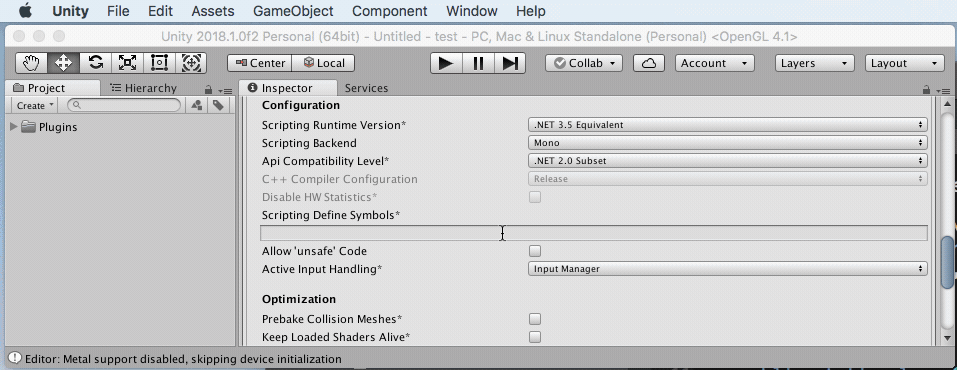
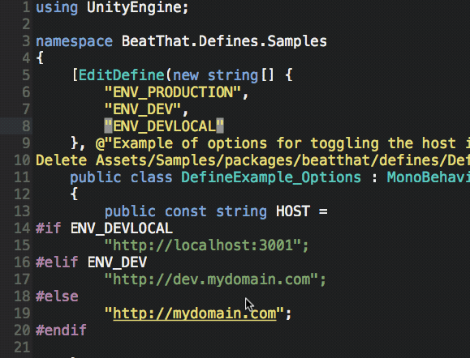

# Defines - Unity

Make the define symbols in Unity projects discoverable and easy to enable/disable with an editor window.

## Usage

#### Define/Undefine Symbols

Follow these steps to define or undefine symbols already annotated in your project's code:

1. ```Window => Define Scripting Symbols```
2. Check/uncheck symbols in the list
3. Tap ```Save```



#### Use ```[EditDefine]``` to Make a Define Option Show in Editor

For any define that you want visible in the Define Scripting Symbols window, add ```[EditDefine]``` to at least one class. The attribute must be applied to a class, not a method or other.

```csharp
[EditDefine(
    "MY_CUSTOM_DEFINE",
    "When defined, MyClass does something different on Start"
    )
]
public class MyClass
{
    void Start()
    {
        #if MY_CUSTOM_DEFINE
        // some custom behavior
        #endif
    }
}
```

#### Create an options-style define by passing an array of symbols to ```[EditDefine]```

Defines can be useful switching among a set of configuration options. A common example is configuring which env 'stage' your server-connected app is pointing at, e.g. dev or production.

```csharp
[EditDefine(
    new string[] {
        "ENV_PRODUCTION",
        "ENV_DEV",
        "ENV_DEVLOCAL"
    },
    "Toggle the server environment"
    )
]
public class ServerConfig
{
    public const string HOST =
    #if ENV_DEVLOCAL
        "http://localhost:3001";
    #elif ENV_DEV
        "http://dev.mydomain.com";
    #else
        "http://mydomain.com";
    #endif
}
```



## Install

From your unity project folder:

    npm init
    npm install beatthat/defines --save

## Development

You can edit the code and samples in the test environment and then use ```npm run overwrite:test2src``` to sync changes back to the package src.

```
    npm run install:test
    cd test

    # edit code under Assets/Plugins/packages/beatthat/defines
    # edit samples under Assets/Samples/packages/beatthat/defines

    # sync changes back to src
    npm run overwrite:test2src
```

**REMEMBER:** changes made under the test folder are not saved to the package
unless they are copied back into the source folder
